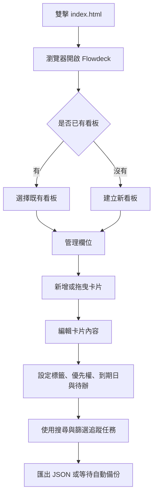
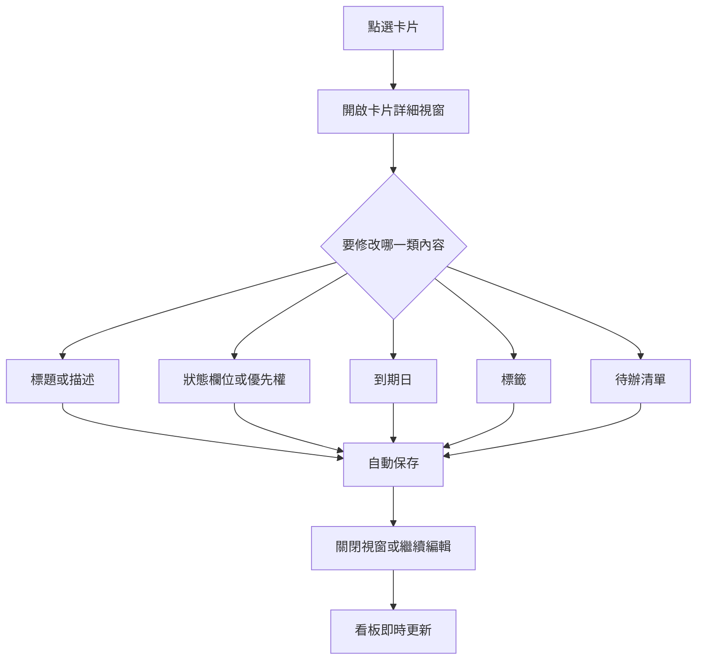
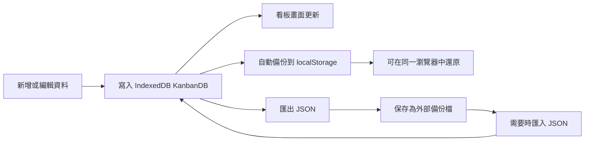

# Flowdeck 使用者操作手冊

Flowdeck 是一個可在本機離線使用的 Kanban 工作看板。你可以用它整理任務、追蹤卡片狀態、設定到期日、建立標籤與待辦清單，資料會保存在目前瀏覽器的本機儲存空間中，不會送到外部服務。

## 目錄

- [快速開始](#快速開始)
- [整體使用流程](#整體使用流程)
- [介面區域](#介面區域)
- [看板操作](#看板操作)
- [欄位操作](#欄位操作)
- [卡片操作](#卡片操作)
- [搜尋與篩選](#搜尋與篩選)
- [資料保存、匯出與匯入](#資料保存匯出與匯入)
- [外觀模式](#外觀模式)
- [離線與資料安全](#離線與資料安全)
- [常見問題](#常見問題)
- [維護者驗證](#維護者驗證)

## 快速開始

1. 開啟 Flowdeck 專案資料夾。
2. 直接雙擊根目錄的 `index.html`。
3. 瀏覽器會開啟 Flowdeck，並可立即開始使用。

一般使用不需要安裝或啟動下列項目：

- Python
- Node.js
- npm
- 本機 HTTP server
- 外部網路
- CDN

正式入口是根目錄的 `index.html`，它會載入本機檔案 `src/flowdeck.bundle.js`。這個檔案已整合應用程式需要的 JavaScript 與本地 SVG 圖示，因此可以直接從 `file://` 執行。

## 整體使用流程



## 介面區域

Flowdeck 主要由下列區域組成：

- `側邊欄`：切換看板、建立看板、進入匯入匯出與設定相關操作。
- `頂部工具列`：顯示目前看板名稱，提供搜尋、篩選、外觀模式切換等操作。
- `看板工作區`：以欄位呈現任務流程，例如待處理、進行中、已完成。
- `卡片`：代表單一任務，可拖曳、開啟、編輯與分類。
- `卡片詳細視窗`：編輯標題、描述、狀態欄位、優先權、到期日、標籤與待辦清單。

## 看板操作

### 新增看板

1. 在側邊欄點選新增看板。
2. 輸入看板名稱。
3. 建立後即可在該看板中新增欄位與卡片。

### 切換看板

在側邊欄點選任一看板名稱，即可切換到該看板。Flowdeck 會記住目前選取的看板，下次開啟時會優先回到同一個看板。

### 重新命名看板

1. 進入要修改的看板。
2. 使用看板名稱旁的編輯操作。
3. 輸入新名稱並確認。

### 刪除看板

刪除看板會移除該看板底下的欄位、卡片、標籤關聯與待辦資料。執行前建議先匯出備份。

## 欄位操作

欄位用來表示任務狀態或流程階段，例如：

- 待處理
- 進行中
- 待確認
- 已完成

### 新增欄位

在看板工作區點選新增欄位，輸入欄位名稱後建立。

### 重新命名欄位

點選欄位標題附近的選單或編輯操作，輸入新的欄位名稱並確認。

### 刪除欄位

刪除欄位會一併移除欄位中的卡片。若卡片仍需保留，請先拖曳到其他欄位。

### 調整欄位順序

拖曳欄位即可調整看板上的顯示順序。順序會自動保存到本機資料庫。

## 卡片操作

卡片是 Flowdeck 的核心任務單位。每張卡片可以包含標題、描述、狀態欄位、優先權、到期日、標籤與待辦清單。

### 新增卡片

1. 在目標欄位底部點選新增卡片。
2. 輸入卡片標題。
3. 新卡片會建立在該欄位中。

### 開啟與編輯卡片

點選卡片即可開啟詳細視窗。可編輯的內容包含：

- 標題
- 描述
- 所屬欄位
- 優先權
- 到期日
- 標籤
- 待辦清單

### 卡片編輯流程



### 設定到期日

1. 開啟卡片詳細視窗。
2. 在到期日欄位點選日期輸入框。
3. 選擇日期。
4. Flowdeck 會保存到期日，卡片列表也會同步顯示。

若只修改到期日，卡片不應重複出現在欄位中；這項行為已納入回歸檢查。

### 設定優先權

在卡片詳細視窗中使用優先權下拉選單，可將卡片設定為不同優先程度。優先權會顯示在卡片摘要資訊中，方便掃描工作輕重緩急。

### 使用標籤

標籤可用來標示專案、類型、負責人或情境。可在卡片詳細視窗中新增、選取、移除標籤，也可透過標籤篩選快速找到相關卡片。

### 使用待辦清單

卡片可建立多個待辦項目。每個項目可勾選完成，適合拆分單一任務中的子步驟。

### 拖曳卡片

你可以拖曳卡片：

- 在同一欄位內調整順序。
- 拖到其他欄位以改變狀態。

拖曳後的位置與欄位會自動保存。

### 刪除卡片

在卡片詳細視窗中點選刪除卡片。刪除後，該卡片的描述、標籤關聯與待辦清單也會一併移除。

## 搜尋與篩選

搜尋與篩選可協助你在大量卡片中快速找到目標任務。

可用條件包含：

- 關鍵字：搜尋卡片標題與描述。
- 標籤：只顯示符合指定標籤的卡片。
- 優先權：依照優先程度篩選。
- 到期日：找出特定期限範圍內的卡片。

若看不到預期卡片，請先確認是否仍套用搜尋字或篩選條件，必要時清除篩選。

## 資料保存、匯出與匯入

Flowdeck 的資料會保存在目前瀏覽器的本機儲存空間。一般操作完成後會自動保存，不需要手動按儲存。



### 自動保存

下列操作會寫入本機資料庫：

- 新增、重新命名、刪除看板。
- 新增、重新命名、刪除欄位。
- 新增、編輯、拖曳、刪除卡片。
- 修改卡片描述、優先權、到期日、標籤與待辦清單。

### 匯出 JSON

建議在下列情境先匯出備份：

- 要更換電腦或瀏覽器。
- 要清除瀏覽器資料。
- 要大幅整理看板資料。
- 要分享目前看板資料給自己或團隊保存。

匯出的 JSON 是資料備份檔，可在之後重新匯入。

### 匯入 JSON

匯入會把備份檔中的看板資料載入 Flowdeck。匯入前請確認目前資料是否已另行備份，避免覆蓋或混淆既有內容。

### 還原初始設定

還原初始設定會清除目前本機資料並回到預設狀態。執行前請先匯出 JSON 備份。

## 外觀模式

Flowdeck 支援深色與淺色模式。切換後偏好會保存在 `localStorage`，下次開啟時會沿用相同外觀。

## 離線與資料安全

Flowdeck 是本機端靜態網頁應用：

- 不需要登入。
- 不會連線到後端伺服器。
- 不依賴外部 CDN。
- 不會把看板資料上傳到外部服務。

主要資料儲存在瀏覽器 IndexedDB：

- `boards`
- `columns`
- `cards`
- `tags`
- `cardTags`
- `checklists`

輔助狀態儲存在 `localStorage`：

- `flowdeck:active-board-id`
- `KanbanDB_AutoBackup`
- `flowdeck:theme`

請注意：資料綁定在目前瀏覽器與目前使用者環境中。換瀏覽器、清除瀏覽器資料、使用無痕模式，或企業安全政策限制 `file://` 儲存時，可能看不到原本資料。

## 常見問題

### 我可以真的雙擊網頁就使用嗎？

可以。一般使用直接雙擊根目錄的 `index.html` 即可，不需要先啟動 Python、不需要 Node.js，也不需要連網。

### 為什麼換瀏覽器後看不到資料？

Flowdeck 使用瀏覽器本機 IndexedDB 保存資料。Chrome、Edge、Firefox 各自有不同的本機資料庫，因此換瀏覽器時不會自動共用資料。請先在原瀏覽器匯出 JSON，再到新瀏覽器匯入。

### 為什麼重新整理後資料沒有保留？

一般桌面瀏覽器可從 `file://` 使用 IndexedDB。若瀏覽器、無痕模式或企業安全政策封鎖 `file://` 的 IndexedDB，Flowdeck 可能退回當次記憶體模式；當次可操作，但重新整理或關閉後不會保留。遇到這種情況，請改用一般瀏覽模式，或洽系統管理員確認瀏覽器政策。

### 到期日可以設定嗎？

可以。開啟卡片詳細視窗後，在右側到期日欄位選擇日期即可。設定後會自動保存並顯示在卡片摘要中。

### 只修改日期時，卡片會不會變成兩筆？

不應該。Flowdeck 已針對只修改到期日的情境修正渲染流程，避免同一張卡片在欄位中重複顯示。

### 可以多人同步使用嗎？

目前不支援即時多人同步。Flowdeck 是單機本機端工具，如需搬移資料，請使用 JSON 匯出與匯入。

### 可以直接編輯資料庫嗎？

不建議。請優先使用介面操作與 JSON 匯出匯入。直接修改 IndexedDB 可能造成資料關聯不一致。

## 維護者驗證

一般使用者不需要 Node.js。以下命令只給維護者在修改程式後做靜態檢查與回歸驗證。

```powershell
node test\*.mjs
node --check src\flowdeck.bundle.js
```

修改 `src/` 下的模組原始碼時，請同步更新 `src/flowdeck.bundle.js`，因為雙擊 `index.html` 實際執行的是這個 standalone runtime。

建議手動驗證：

- 雙擊 `index.html` 可正常開啟。
- 新增看板、欄位、卡片後重新整理仍保留資料。
- 卡片到期日可設定，關閉並重新開啟後仍保留。
- 只修改到期日不會讓同一張卡片重複顯示。
- 搜尋、篩選、標籤、待辦清單可正常操作。
- JSON 匯出與匯入可正常完成。
