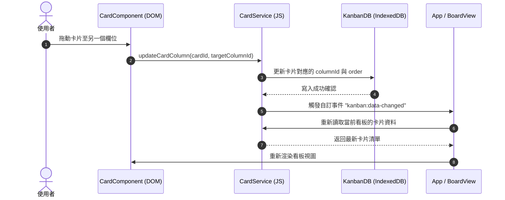

# 系統架構設計文件 (System Architecture)

本文件描述 Kanban Board 專案的軟體架構、模組關係與單向資料流設計。

## 1. 系統架構圖 (Architecture Diagram)
專案採用**功能導向架構 (Feature-Based Architecture)**，將系統功能模組化，避免全域變數與上帝類別。

```mermaid
graph TD
    subgraph UI Layer (View)
        IndexHTML[index.html] --> AppJS[src/app.js]
        AppJS --> UI_Components[UI Components / Modals]
    end

    subgraph Feature Layer (Controller / Component)
        UI_Components --> BoardComponent[Board Component]
        UI_Components --> ColumnComponent[Column Component]
        UI_Components --> CardComponent[Card Component]
    end

    subgraph Service Layer (Business Logic)
        BoardComponent --> BoardService[Board Service]
        ColumnComponent --> ColumnService[Column Service]
        CardComponent --> CardService[Card Service]
        CardComponent --> ChecklistService[Checklist Service]
        CardComponent --> TagService[Tag Service]
    end

    subgraph Core Layer (Data Access & Storage)
        BoardService --> KanbanDB[src/core/db/KanbanDB.js]
        ColumnService --> KanbanDB
        CardService --> KanbanDB
        ChecklistService --> KanbanDB
        TagService --> KanbanDB
        
        KanbanDB --> IndexedDB[(Browser IndexedDB)]
        BackupService[src/core/storage/BackupService.js] --> KanbanDB
    end
```

---

## 2. 單向資料流與時序圖 (Sequence Diagram & Unidirectional Data Flow)
本專案採用單向資料流（Unidirectional Data Flow）思想：
1. **View (DOM)** 發送一個事件或動作（如：拖放卡片）。
2. **Controller/Component** 接收事件，呼叫 **Service** 更新資料。
3. **Service** 將資料寫入 **IndexedDB (KanbanDB)**。
4. **Service** 廣播狀態變更事件（透過 `CustomEvent`），通知 **View** 重新取得資料並渲染。

### 時序範例：卡片拖曳更新狀態



---

## 3. 元件與核心服務說明 (Component & Service Specifications)

### 3.1 核心資料庫 (src/core/db/KanbanDB.js)
- 唯一的 IndexedDB 介面，使用 Promise 封裝原生 Callback 導向的 IndexedDB API。
- 提供資料庫升級機制 (Upgrade Transaction)，建立所有 Object Store (Boards, Columns, Cards, Tags, CardTags, Checklist)。

### 3.2 基礎功能模組 (features/)
- **Model**：定義 Entity Schema 的純 JS 物件（無狀態）。
- **Service**：無狀態或包含極簡快取狀態的邏輯類別。負責核心 CRUD 計算、與 `KanbanDB` 互動、觸發變更事件。
- **Component**：負責 DOM 結構的生成、事件監聽（如 `click`、`dragstart` 等）以及 DOM 節點的渲染。

### 3.3 全域 UI (src/ui/)
- 提供統一的 Dialog（如刪除確認）、Toast（通知提示）以及全域 CSS 設計系統。
- `src/app.js` 為程式的引導核心 (Bootstrapper)，負責檢查資料庫、載入當前看板，並將各 Component 掛載至 `index.html` 上的掛載點。
