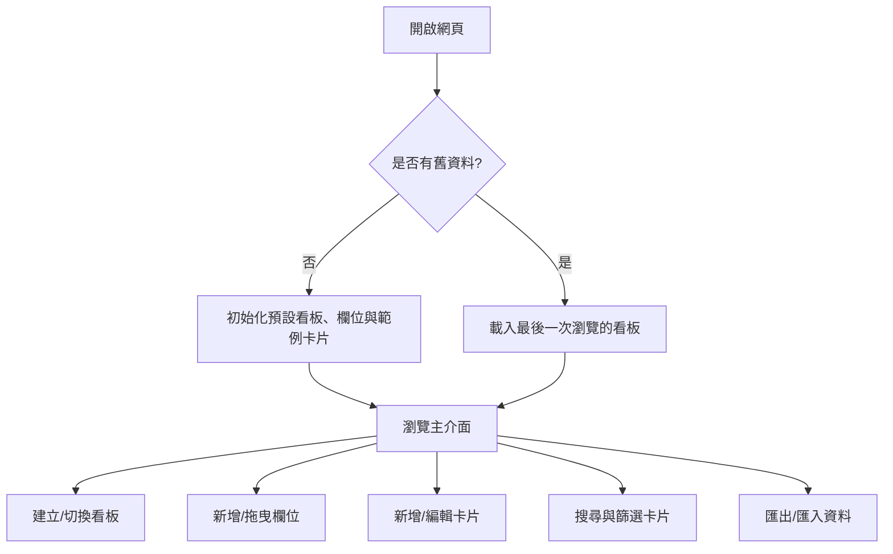

# 產品需求文件 (Product Requirement Document)

## 1. 專案背景與目標 (Background & Goals)
本專案旨在開發一個極速、美觀、專為個人生產力設計的現代化看板系統（Kanban Board）。
介面風格將融合 Linear、Notion 與 GitHub Projects 的精緻、現代與輕量感，擺脫 Trello 的傳統樣式。
所有介面 (UI) 均採用**繁體中文**。

## 2. 目標使用者與場景 (Target Audience & Scenarios)
- **個人開發者與設計師**：需要一個快速啟動、無需登入、資料儲存在本地的任務管理工具。
- **專案管理愛好者**：追求極簡、具備玻璃擬態（Glassmorphism）與流暢動畫的優質視覺體驗。
- **無網路或隱私敏感用戶**：希望所有資料均保存在本地瀏覽器（IndexedDB），且能隨時匯出備份。

## 3. 核心功能模組 (Core Feature Modules)

### 3.1 看板管理 (Board Management)
- **建立看板**：使用者可新建多個獨立的看板，用於不同的專案。
- **重新命名**：點擊看板標題可直接修改名稱。
- **刪除看板**：刪除看板時應彈出確認視窗，避免誤刪，並同時刪除該看板下所有的欄位與卡片。
- **快速切換**：側邊欄提供看板清單，點擊可即時切換。

### 3.2 欄位管理 (Column Management)
- **建立欄位**：在看板內新增狀態欄位（例如：待處理、進行中、已完成）。
- **欄位排序**：支援以拖拽（Drag & Drop）方式調整欄位順序。
- **欄位操作**：可重新命名或刪除欄位。

### 3.3 卡片管理 (Card Management)
- **建立卡片**：在特定欄位下快速新增任務卡片。
- **卡片編輯**：點擊卡片彈出詳細編輯視窗（Modal）。
  - **任務描述**：支援 Markdown 編輯與渲染。
  - **優先權**：提供「高」、「中」、「低」三種優先順序。
  - **到期日**：支援設定任務截止日期，並在卡片上顯示。
  - **待辦清單 (Checklist)**：可在卡片內建立子任務，並支援拖曳排序與勾選完成。
  - **標籤 (Tags)**：可為卡片指派多個標籤，標籤具備自訂顏色。
- **卡片拖放**：可在不同欄位之間拖曳卡片以改變任務狀態，或在同欄位內拖曳調整順序。
- **刪除卡片**：可在詳情頁或快速選單中刪除卡片。

### 3.4 搜尋與篩選 (Search & Filter)
- **關鍵字搜尋**：輸入文字即時模糊搜尋卡片的標題與描述（Debounce 處理）。
- **標籤篩選**：可選取一個或多個標籤進行聯集/交集篩選。
- **屬性篩選**：依優先權（高、中、低）或到期日範圍進行篩選。

### 3.5 資料安全與備份 (Data Safety & Backup)
- **JSON 匯出**：一鍵將所有看板、欄位、卡片、標籤及待辦資料導出為單一 JSON 檔案。
- **JSON 匯入**：支援匯入 JSON 備份檔案以還原資料庫。
- **自動備份**：每當資料庫有寫入變更時，自動在 LocalStorage 儲存一份備份快照，以防 IndexedDB 異常。

## 4. 使用者流程 (User Flows)

### 4.1 建立任務流程
1. 使用者在特定欄位（如「待處理」）底部點擊「+ 新增卡片」。
2. 輸入卡片標題後按下 Enter 或點擊確定，卡片即時渲染在該欄位底部。
3. 點擊該卡片，彈出詳細編輯視窗。
4. 輸入任務描述（Markdown）、設定優先權（高）、設定到期日，並新增數個待辦子任務。
5. 點擊「儲存」或關閉彈出視窗，主介面卡片元件即時更新，顯示優先權標籤與待辦進度條。

## 5. UI 流程設計 (UI Flows)
- **主畫面**：
  - **左側側邊欄**：看板清單、建立看板按鈕、匯出/匯入資料按鈕。
  - **頂部列**：當前看板名稱（點擊可重命名）、搜尋與篩選列（關鍵字、標籤、優先級篩選器）。
  - **中央看板區**：橫向排列的欄位，每個欄位內垂直排列卡片，底部有新增卡片入口。
- **彈出視窗 (Modal)**：
  - **卡片詳情 Modal**：左側為標題與 Markdown 編輯區、待辦清單區；右側側邊欄為屬性設定（欄位狀態、優先權、到期日、標籤選擇）。

## 6. 非功能性需求 (Non-Functional Requirements)
- **語系**：介面中所有文字（按鈕、提示、日期格式、狀態值）皆必須使用**繁體中文**。
- **效能**：卡片數量多時，拖放操作需保持 60fps 的流暢度；使用事件委派（Event Delegation）減少 DOM 監聽器。
- **視覺**：支援深色模式（Dark Mode），元件背景採用磨砂玻璃質感（backdrop-filter），微小動畫流暢。
